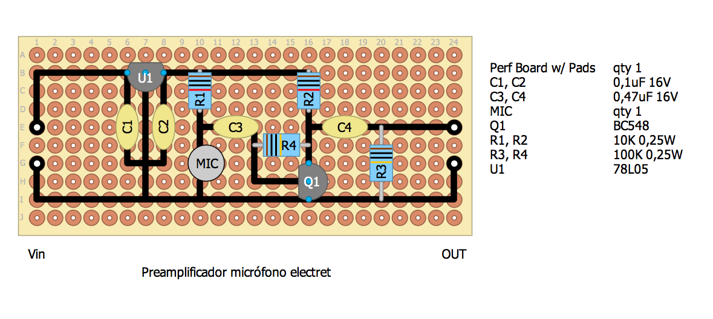
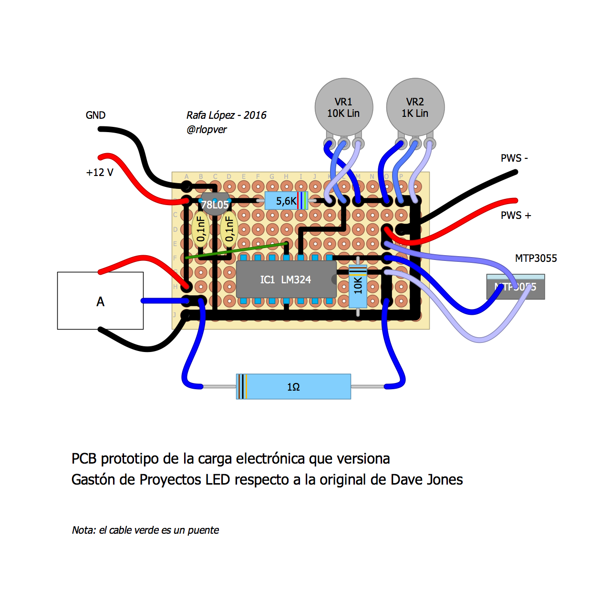

# PCB

Prototype PCB designs on perforated plates edited with [DIY Layout Creator](https://github.com/bancika/diy-layout-creator).

[GNU GPL V3](./LICENSE.md)

Content:

File | Description
-----|------------
preamplificadorElectret.diy | Electret preamplifier from https://www.youtube.com/watch?v=1dHBGoEFBqU 
cargaElectronica.diy | Dummy load from https://www.youtube.com/watch?v=C6qzPjkVcAM 
